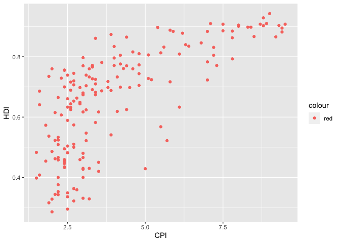
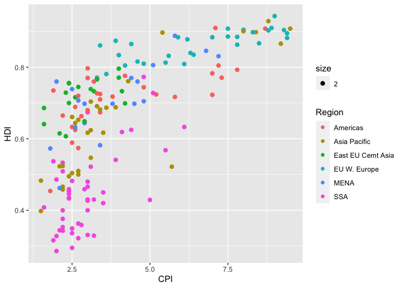
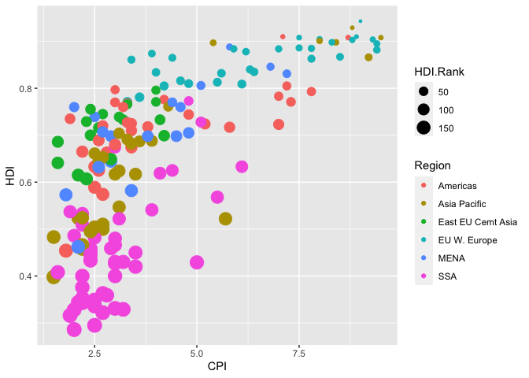
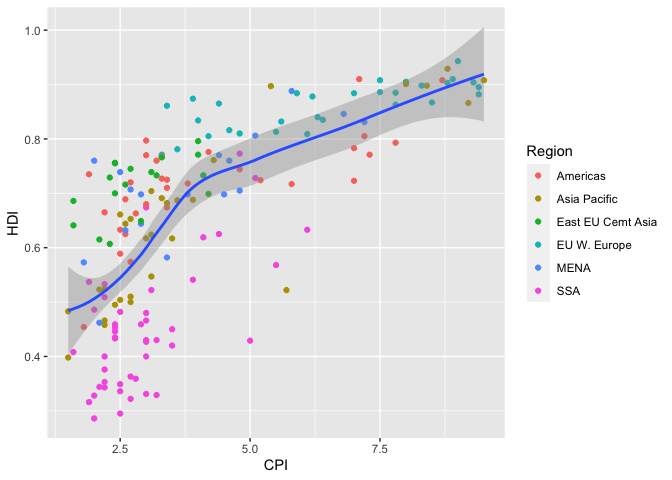
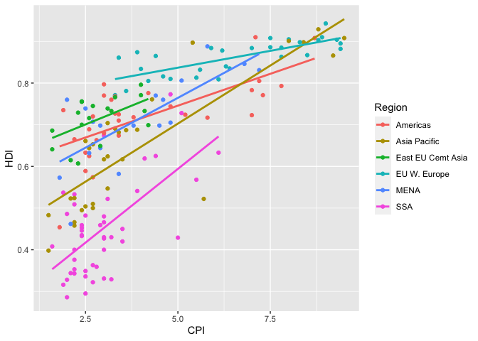
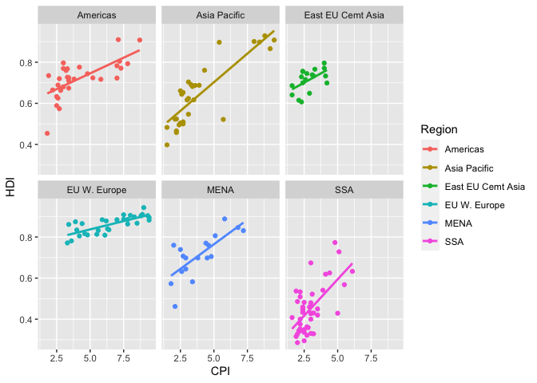
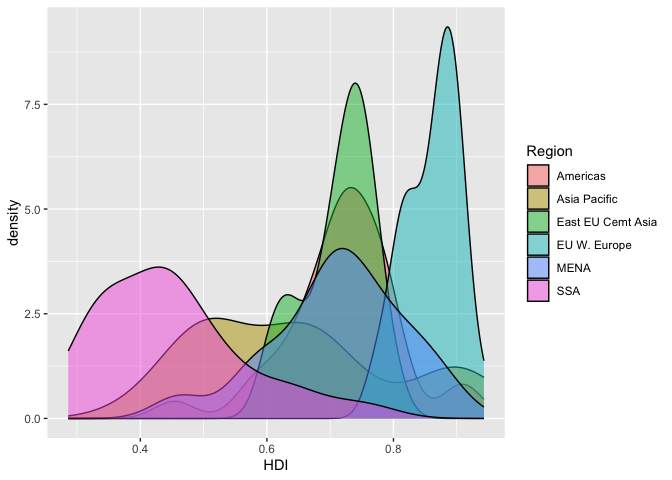
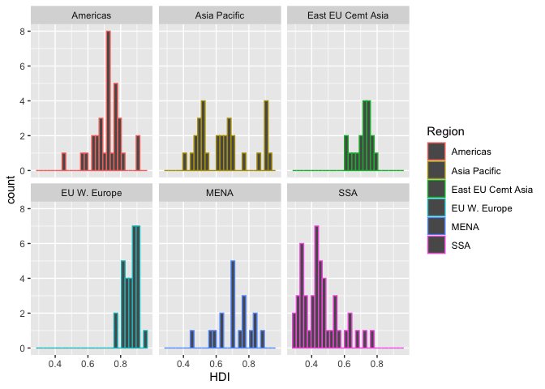
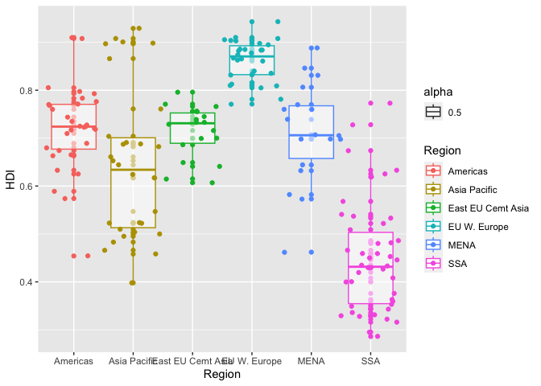

assignment_4
================
Wyatt
2023-03-01

# Assignment 4: Data transformation and visualization

## Load packages

To start, load all the required packages with the following code.
Install them if they are not installed yet.

``` r
library(tidyverse)
```

    ## ── Attaching packages ─────────────────────────────────────── tidyverse 1.3.2 ──
    ## ✔ ggplot2 3.4.0      ✔ purrr   1.0.1 
    ## ✔ tibble  3.1.8      ✔ dplyr   1.0.10
    ## ✔ tidyr   1.3.0      ✔ stringr 1.5.0 
    ## ✔ readr   2.1.3      ✔ forcats 1.0.0 
    ## ── Conflicts ────────────────────────────────────────── tidyverse_conflicts() ──
    ## ✖ dplyr::filter() masks stats::filter()
    ## ✖ dplyr::lag()    masks stats::lag()

``` r
library(knitr)
```

<br>

## Exercise 1. Corruption and human development

This exercise explores a dataset containing the human development index
(`HDI`) and corruption perception index (`CPI`) of 173 countries across
6 different regions around the world: Americas, Asia Pacific, Eastern
Europe and Central Asia (`East EU Cemt`), Western Europe
(`EU W. Europe`), Middle East and North Africa and Noth Africa (`MENA`),
and Sub-Saharan Africa (`SSA`). (Note: the larger `CPI` is, the less
corrupted the country is perceived to be.)

<br>

First, we load the data using the following code.

``` r
economist_data <- read_csv("https://raw.githubusercontent.com/nt246/NTRES-6100-data-science/master/datasets/EconomistData.csv")
```

    ## New names:
    ## Rows: 173 Columns: 6
    ## ── Column specification
    ## ──────────────────────────────────────────────────────── Delimiter: "," chr
    ## (2): Country, Region dbl (4): ...1, HDI.Rank, HDI, CPI
    ## ℹ Use `spec()` to retrieve the full column specification for this data. ℹ
    ## Specify the column types or set `show_col_types = FALSE` to quiet this message.
    ## • `` -> `...1`

<br>

#### 1.1 Show the first few rows of `economist_data`.

``` r
economist_data
```

    ## # A tibble: 173 × 6
    ##     ...1 Country     HDI.Rank   HDI   CPI Region           
    ##    <dbl> <chr>          <dbl> <dbl> <dbl> <chr>            
    ##  1     1 Afghanistan      172 0.398   1.5 Asia Pacific     
    ##  2     2 Albania           70 0.739   3.1 East EU Cemt Asia
    ##  3     3 Algeria           96 0.698   2.9 MENA             
    ##  4     4 Angola           148 0.486   2   SSA              
    ##  5     5 Argentina         45 0.797   3   Americas         
    ##  6     6 Armenia           86 0.716   2.6 East EU Cemt Asia
    ##  7     7 Australia          2 0.929   8.8 Asia Pacific     
    ##  8     8 Austria           19 0.885   7.8 EU W. Europe     
    ##  9     9 Azerbaijan        91 0.7     2.4 East EU Cemt Asia
    ## 10    10 Bahamas           53 0.771   7.3 Americas         
    ## # … with 163 more rows

<br>

#### 1.2 Expore the relationship between human development index (`HDI`) and corruption perception index (`CPI`) with a scatter plot as the following.

``` r
economist_data %>% 
  ggplot(mapping = aes(x = CPI, y = HDI)) +
  geom_point()
```

<!-- -->

<br>

#### 1.3 Make the color of all points in the previous plot red.

``` r
economist_data %>% 
  ggplot(mapping = aes(x = CPI, y = HDI, color = "red")) +
  geom_point()
```

<!-- -->

<br>

#### 1.4 Color the points in the previous plot according to the `Region` variable, and set the size of points to 2.

``` r
economist_data %>%
  ggplot(mapping = aes(x = CPI, y = HDI, color = Region, size = "2")) +
  geom_point()
```

    ## Warning: Using size for a discrete variable is not advised.

<!-- -->

<br>

#### 1.5 Set the size of the points proportional to `HDI.Rank`

``` r
economist_data %>%
  ggplot(mapping = aes(x = CPI, y = HDI, color = Region, size = HDI.Rank)) +
  geom_point()
```

<!-- -->

<br>

#### 1.6 Fit a **smoothing line** to **all** the data points in the scatter plot from Excercise 1.4

``` r
economist_data %>%
  ggplot(mapping = aes(x = CPI, y = HDI)) +
  geom_point(mapping = aes(color = Region)) + 
  geom_smooth()
```

    ## `geom_smooth()` using method = 'loess' and formula = 'y ~ x'

<!-- -->

<br>

#### 1.7 Fit a separate **straight line** for **each region** instead, and turn off the confidence interval.

``` r
economist_data %>% 
  ggplot(mapping = aes(x = CPI, y = HDI, color = Region)) +
  geom_point() +
  geom_smooth(method = lm, se = FALSE)
```

    ## `geom_smooth()` using formula = 'y ~ x'

<!-- -->

<br>

#### 1.8 Building on top of the previous plot, show each `Region` in a different facet.

``` r
economist_data %>% 
  ggplot(mapping = aes(x = CPI, y = HDI, color = Region)) +
  geom_point() +
  geom_smooth(method = lm, se = FALSE) + 
  facet_wrap(~ Region)
```

    ## `geom_smooth()` using formula = 'y ~ x'

<!-- -->

<br>

#### 1.9 Show the distribution of `HDI` in each region using density plot. Set the transparency to 0.5

``` r
economist_data %>% 
  ggplot() +
  geom_density(aes(fill = Region, x= HDI), alpha = 0.5)
```

<!-- -->

<br>

#### 1.10 Show the distribution of `HDI` in each region using histogram and facetting.

``` r
economist_data %>% 
  ggplot(mapping = aes(x= HDI, color = Region)) +
  geom_histogram(mapping = aes(x= HDI, color = Region)) +
  facet_wrap(~ Region)
```

    ## `stat_bin()` using `bins = 30`. Pick better value with `binwidth`.

<!-- -->

<br>

#### 1.11 Show the distribution of `HDI` in each region using a box plot. Set the transparency of these boxes to 0.5 and do not show outlier points with the box plot. Instead, show all data points for each country in the same plot. (Hint: `geom_jitter()` or `position_jitter()` might be useful.)

``` r
economist_data %>% 
  ggplot(mapping = aes(x = Region, y = HDI, color = Region)) +
  geom_point() +
  geom_boxplot(mapping = aes(x= Region, y = HDI, color = Region, alpha = 0.5), outlier.shape = FALSE, outlier.color = NA)+
  geom_jitter(width = 0.5)
```

<!-- -->

<br>

#### 1.12 Show the count of countries in each region using a bar plot.

``` r
economist_data %>% 
  ggplot() +
  geom_bar(mapping = aes(x = Region))
```

<!-- -->

<br>

#### 1.13 You have now created a variety of different plots of the same dataset. Which of your plots do you think are the most informative? Describe briefly the major trends that you see in the data.

Answer: I beleive that the seperate straight line plot is the most
valuable plot. The reason I believe that it is the most informative
plot, is because we are able to look at multiple Regions and see their
individual CPI and HDI of the data set. On top of this, we are able to
see the corresponding line that goes with the data set. This to me
illustrates that this is the most valuable point, becuase we can easily
distinguish the difference between the different regions and
compare/contrast them as a whole.

<br> <br>

## Exercise 2. Theophylline experiment

This exercise uses the `Theoph` data frame (comes with your R
installation), which has 132 rows and 5 columns of data from an
experiment on the pharmacokinetics of the anti-asthmatic drug
theophylline. Twelve subjects were given oral doses of theophylline then
serum concentrations were measured at 11 time points over the next 25
hours. You can learn more about this dataset by running `?Theoph`

Have a look at the data structure

``` r
kable(head(Theoph))
```

| Subject |   Wt | Dose | Time |  conc |
|:--------|-----:|-----:|-----:|------:|
| 1       | 79.6 | 4.02 | 0.00 |  0.74 |
| 1       | 79.6 | 4.02 | 0.25 |  2.84 |
| 1       | 79.6 | 4.02 | 0.57 |  6.57 |
| 1       | 79.6 | 4.02 | 1.12 | 10.50 |
| 1       | 79.6 | 4.02 | 2.02 |  9.66 |
| 1       | 79.6 | 4.02 | 3.82 |  8.58 |

<br>

For the following exercise, **transform the data as instructed**. Try to
use `tidyverse` functions even if you are more comfortable with base-R
solutions. Show the **first 6 lines** of the transformed data in a table
through RMarkdown **using the kable() function**, as shown above.

#### 2.1 Select columns that contain a lower case “t” in the `Theoph` dataset. Do not manually list all the columns to include.

``` r
Theoph %>% 
  select(Wt)
```

    ##       Wt
    ## 1   79.6
    ## 2   79.6
    ## 3   79.6
    ## 4   79.6
    ## 5   79.6
    ## 6   79.6
    ## 7   79.6
    ## 8   79.6
    ## 9   79.6
    ## 10  79.6
    ## 11  79.6
    ## 12  72.4
    ## 13  72.4
    ## 14  72.4
    ## 15  72.4
    ## 16  72.4
    ## 17  72.4
    ## 18  72.4
    ## 19  72.4
    ## 20  72.4
    ## 21  72.4
    ## 22  72.4
    ## 23  70.5
    ## 24  70.5
    ## 25  70.5
    ## 26  70.5
    ## 27  70.5
    ## 28  70.5
    ## 29  70.5
    ## 30  70.5
    ## 31  70.5
    ## 32  70.5
    ## 33  70.5
    ## 34  72.7
    ## 35  72.7
    ## 36  72.7
    ## 37  72.7
    ## 38  72.7
    ## 39  72.7
    ## 40  72.7
    ## 41  72.7
    ## 42  72.7
    ## 43  72.7
    ## 44  72.7
    ## 45  54.6
    ## 46  54.6
    ## 47  54.6
    ## 48  54.6
    ## 49  54.6
    ## 50  54.6
    ## 51  54.6
    ## 52  54.6
    ## 53  54.6
    ## 54  54.6
    ## 55  54.6
    ## 56  80.0
    ## 57  80.0
    ## 58  80.0
    ## 59  80.0
    ## 60  80.0
    ## 61  80.0
    ## 62  80.0
    ## 63  80.0
    ## 64  80.0
    ## 65  80.0
    ## 66  80.0
    ## 67  64.6
    ## 68  64.6
    ## 69  64.6
    ## 70  64.6
    ## 71  64.6
    ## 72  64.6
    ## 73  64.6
    ## 74  64.6
    ## 75  64.6
    ## 76  64.6
    ## 77  64.6
    ## 78  70.5
    ## 79  70.5
    ## 80  70.5
    ## 81  70.5
    ## 82  70.5
    ## 83  70.5
    ## 84  70.5
    ## 85  70.5
    ## 86  70.5
    ## 87  70.5
    ## 88  70.5
    ## 89  86.4
    ## 90  86.4
    ## 91  86.4
    ## 92  86.4
    ## 93  86.4
    ## 94  86.4
    ## 95  86.4
    ## 96  86.4
    ## 97  86.4
    ## 98  86.4
    ## 99  86.4
    ## 100 58.2
    ## 101 58.2
    ## 102 58.2
    ## 103 58.2
    ## 104 58.2
    ## 105 58.2
    ## 106 58.2
    ## 107 58.2
    ## 108 58.2
    ## 109 58.2
    ## 110 58.2
    ## 111 65.0
    ## 112 65.0
    ## 113 65.0
    ## 114 65.0
    ## 115 65.0
    ## 116 65.0
    ## 117 65.0
    ## 118 65.0
    ## 119 65.0
    ## 120 65.0
    ## 121 65.0
    ## 122 60.5
    ## 123 60.5
    ## 124 60.5
    ## 125 60.5
    ## 126 60.5
    ## 127 60.5
    ## 128 60.5
    ## 129 60.5
    ## 130 60.5
    ## 131 60.5
    ## 132 60.5

<br>

#### 2.2 Rename the `Wt` column to `Weight` and `conc` column to `Concentration` in the `Theoph` dataset.

``` r
Theoph %>% 
  rename(Weight = Wt, concentration = conc)
```

    ## Grouped Data: conc ~ Time | Subject
    ##     Subject Weight Dose  Time concentration
    ## 1         1   79.6 4.02  0.00          0.74
    ## 2         1   79.6 4.02  0.25          2.84
    ## 3         1   79.6 4.02  0.57          6.57
    ## 4         1   79.6 4.02  1.12         10.50
    ## 5         1   79.6 4.02  2.02          9.66
    ## 6         1   79.6 4.02  3.82          8.58
    ## 7         1   79.6 4.02  5.10          8.36
    ## 8         1   79.6 4.02  7.03          7.47
    ## 9         1   79.6 4.02  9.05          6.89
    ## 10        1   79.6 4.02 12.12          5.94
    ## 11        1   79.6 4.02 24.37          3.28
    ## 12        2   72.4 4.40  0.00          0.00
    ## 13        2   72.4 4.40  0.27          1.72
    ## 14        2   72.4 4.40  0.52          7.91
    ## 15        2   72.4 4.40  1.00          8.31
    ## 16        2   72.4 4.40  1.92          8.33
    ## 17        2   72.4 4.40  3.50          6.85
    ## 18        2   72.4 4.40  5.02          6.08
    ## 19        2   72.4 4.40  7.03          5.40
    ## 20        2   72.4 4.40  9.00          4.55
    ## 21        2   72.4 4.40 12.00          3.01
    ## 22        2   72.4 4.40 24.30          0.90
    ## 23        3   70.5 4.53  0.00          0.00
    ## 24        3   70.5 4.53  0.27          4.40
    ## 25        3   70.5 4.53  0.58          6.90
    ## 26        3   70.5 4.53  1.02          8.20
    ## 27        3   70.5 4.53  2.02          7.80
    ## 28        3   70.5 4.53  3.62          7.50
    ## 29        3   70.5 4.53  5.08          6.20
    ## 30        3   70.5 4.53  7.07          5.30
    ## 31        3   70.5 4.53  9.00          4.90
    ## 32        3   70.5 4.53 12.15          3.70
    ## 33        3   70.5 4.53 24.17          1.05
    ## 34        4   72.7 4.40  0.00          0.00
    ## 35        4   72.7 4.40  0.35          1.89
    ## 36        4   72.7 4.40  0.60          4.60
    ## 37        4   72.7 4.40  1.07          8.60
    ## 38        4   72.7 4.40  2.13          8.38
    ## 39        4   72.7 4.40  3.50          7.54
    ## 40        4   72.7 4.40  5.02          6.88
    ## 41        4   72.7 4.40  7.02          5.78
    ## 42        4   72.7 4.40  9.02          5.33
    ## 43        4   72.7 4.40 11.98          4.19
    ## 44        4   72.7 4.40 24.65          1.15
    ## 45        5   54.6 5.86  0.00          0.00
    ## 46        5   54.6 5.86  0.30          2.02
    ## 47        5   54.6 5.86  0.52          5.63
    ## 48        5   54.6 5.86  1.00         11.40
    ## 49        5   54.6 5.86  2.02          9.33
    ## 50        5   54.6 5.86  3.50          8.74
    ## 51        5   54.6 5.86  5.02          7.56
    ## 52        5   54.6 5.86  7.02          7.09
    ## 53        5   54.6 5.86  9.10          5.90
    ## 54        5   54.6 5.86 12.00          4.37
    ## 55        5   54.6 5.86 24.35          1.57
    ## 56        6   80.0 4.00  0.00          0.00
    ## 57        6   80.0 4.00  0.27          1.29
    ## 58        6   80.0 4.00  0.58          3.08
    ## 59        6   80.0 4.00  1.15          6.44
    ## 60        6   80.0 4.00  2.03          6.32
    ## 61        6   80.0 4.00  3.57          5.53
    ## 62        6   80.0 4.00  5.00          4.94
    ## 63        6   80.0 4.00  7.00          4.02
    ## 64        6   80.0 4.00  9.22          3.46
    ## 65        6   80.0 4.00 12.10          2.78
    ## 66        6   80.0 4.00 23.85          0.92
    ## 67        7   64.6 4.95  0.00          0.15
    ## 68        7   64.6 4.95  0.25          0.85
    ## 69        7   64.6 4.95  0.50          2.35
    ## 70        7   64.6 4.95  1.02          5.02
    ## 71        7   64.6 4.95  2.02          6.58
    ## 72        7   64.6 4.95  3.48          7.09
    ## 73        7   64.6 4.95  5.00          6.66
    ## 74        7   64.6 4.95  6.98          5.25
    ## 75        7   64.6 4.95  9.00          4.39
    ## 76        7   64.6 4.95 12.05          3.53
    ## 77        7   64.6 4.95 24.22          1.15
    ## 78        8   70.5 4.53  0.00          0.00
    ## 79        8   70.5 4.53  0.25          3.05
    ## 80        8   70.5 4.53  0.52          3.05
    ## 81        8   70.5 4.53  0.98          7.31
    ## 82        8   70.5 4.53  2.02          7.56
    ## 83        8   70.5 4.53  3.53          6.59
    ## 84        8   70.5 4.53  5.05          5.88
    ## 85        8   70.5 4.53  7.15          4.73
    ## 86        8   70.5 4.53  9.07          4.57
    ## 87        8   70.5 4.53 12.10          3.00
    ## 88        8   70.5 4.53 24.12          1.25
    ## 89        9   86.4 3.10  0.00          0.00
    ## 90        9   86.4 3.10  0.30          7.37
    ## 91        9   86.4 3.10  0.63          9.03
    ## 92        9   86.4 3.10  1.05          7.14
    ## 93        9   86.4 3.10  2.02          6.33
    ## 94        9   86.4 3.10  3.53          5.66
    ## 95        9   86.4 3.10  5.02          5.67
    ## 96        9   86.4 3.10  7.17          4.24
    ## 97        9   86.4 3.10  8.80          4.11
    ## 98        9   86.4 3.10 11.60          3.16
    ## 99        9   86.4 3.10 24.43          1.12
    ## 100      10   58.2 5.50  0.00          0.24
    ## 101      10   58.2 5.50  0.37          2.89
    ## 102      10   58.2 5.50  0.77          5.22
    ## 103      10   58.2 5.50  1.02          6.41
    ## 104      10   58.2 5.50  2.05          7.83
    ## 105      10   58.2 5.50  3.55         10.21
    ## 106      10   58.2 5.50  5.05          9.18
    ## 107      10   58.2 5.50  7.08          8.02
    ## 108      10   58.2 5.50  9.38          7.14
    ## 109      10   58.2 5.50 12.10          5.68
    ## 110      10   58.2 5.50 23.70          2.42
    ## 111      11   65.0 4.92  0.00          0.00
    ## 112      11   65.0 4.92  0.25          4.86
    ## 113      11   65.0 4.92  0.50          7.24
    ## 114      11   65.0 4.92  0.98          8.00
    ## 115      11   65.0 4.92  1.98          6.81
    ## 116      11   65.0 4.92  3.60          5.87
    ## 117      11   65.0 4.92  5.02          5.22
    ## 118      11   65.0 4.92  7.03          4.45
    ## 119      11   65.0 4.92  9.03          3.62
    ## 120      11   65.0 4.92 12.12          2.69
    ## 121      11   65.0 4.92 24.08          0.86
    ## 122      12   60.5 5.30  0.00          0.00
    ## 123      12   60.5 5.30  0.25          1.25
    ## 124      12   60.5 5.30  0.50          3.96
    ## 125      12   60.5 5.30  1.00          7.82
    ## 126      12   60.5 5.30  2.00          9.72
    ## 127      12   60.5 5.30  3.52          9.75
    ## 128      12   60.5 5.30  5.07          8.57
    ## 129      12   60.5 5.30  7.07          6.59
    ## 130      12   60.5 5.30  9.03          6.11
    ## 131      12   60.5 5.30 12.05          4.57
    ## 132      12   60.5 5.30 24.15          1.17

<br>

#### 2.3 Extract the `Dose` greater than 4.5 and `Time` greater than the mean `Time`.

``` r
Theoph %>% 
  filter(Dose>4.5, Time > mean(Time)) %>% 
  rename(Weight = Wt, concentration = conc)
```

    ## Grouped Data: conc ~ Time | Subject
    ##    Subject Weight Dose  Time concentration
    ## 1        3   70.5 4.53  7.07          5.30
    ## 2        3   70.5 4.53  9.00          4.90
    ## 3        3   70.5 4.53 12.15          3.70
    ## 4        3   70.5 4.53 24.17          1.05
    ## 5        5   54.6 5.86  7.02          7.09
    ## 6        5   54.6 5.86  9.10          5.90
    ## 7        5   54.6 5.86 12.00          4.37
    ## 8        5   54.6 5.86 24.35          1.57
    ## 9        7   64.6 4.95  6.98          5.25
    ## 10       7   64.6 4.95  9.00          4.39
    ## 11       7   64.6 4.95 12.05          3.53
    ## 12       7   64.6 4.95 24.22          1.15
    ## 13       8   70.5 4.53  7.15          4.73
    ## 14       8   70.5 4.53  9.07          4.57
    ## 15       8   70.5 4.53 12.10          3.00
    ## 16       8   70.5 4.53 24.12          1.25
    ## 17      10   58.2 5.50  7.08          8.02
    ## 18      10   58.2 5.50  9.38          7.14
    ## 19      10   58.2 5.50 12.10          5.68
    ## 20      10   58.2 5.50 23.70          2.42
    ## 21      11   65.0 4.92  7.03          4.45
    ## 22      11   65.0 4.92  9.03          3.62
    ## 23      11   65.0 4.92 12.12          2.69
    ## 24      11   65.0 4.92 24.08          0.86
    ## 25      12   60.5 5.30  7.07          6.59
    ## 26      12   60.5 5.30  9.03          6.11
    ## 27      12   60.5 5.30 12.05          4.57
    ## 28      12   60.5 5.30 24.15          1.17

<br>

#### 2.4 Sort the `Theoph` dataset by `Wt` from smallest to largest and secondarily by Time from largest to smallest.

``` r
Theoph %>%
  arrange(Wt,desc(Time))
```

    ## Grouped Data: conc ~ Time | Subject
    ##     Subject   Wt Dose  Time  conc
    ## 1         5 54.6 5.86 24.35  1.57
    ## 2         5 54.6 5.86 12.00  4.37
    ## 3         5 54.6 5.86  9.10  5.90
    ## 4         5 54.6 5.86  7.02  7.09
    ## 5         5 54.6 5.86  5.02  7.56
    ## 6         5 54.6 5.86  3.50  8.74
    ## 7         5 54.6 5.86  2.02  9.33
    ## 8         5 54.6 5.86  1.00 11.40
    ## 9         5 54.6 5.86  0.52  5.63
    ## 10        5 54.6 5.86  0.30  2.02
    ## 11        5 54.6 5.86  0.00  0.00
    ## 12       10 58.2 5.50 23.70  2.42
    ## 13       10 58.2 5.50 12.10  5.68
    ## 14       10 58.2 5.50  9.38  7.14
    ## 15       10 58.2 5.50  7.08  8.02
    ## 16       10 58.2 5.50  5.05  9.18
    ## 17       10 58.2 5.50  3.55 10.21
    ## 18       10 58.2 5.50  2.05  7.83
    ## 19       10 58.2 5.50  1.02  6.41
    ## 20       10 58.2 5.50  0.77  5.22
    ## 21       10 58.2 5.50  0.37  2.89
    ## 22       10 58.2 5.50  0.00  0.24
    ## 23       12 60.5 5.30 24.15  1.17
    ## 24       12 60.5 5.30 12.05  4.57
    ## 25       12 60.5 5.30  9.03  6.11
    ## 26       12 60.5 5.30  7.07  6.59
    ## 27       12 60.5 5.30  5.07  8.57
    ## 28       12 60.5 5.30  3.52  9.75
    ## 29       12 60.5 5.30  2.00  9.72
    ## 30       12 60.5 5.30  1.00  7.82
    ## 31       12 60.5 5.30  0.50  3.96
    ## 32       12 60.5 5.30  0.25  1.25
    ## 33       12 60.5 5.30  0.00  0.00
    ## 34        7 64.6 4.95 24.22  1.15
    ## 35        7 64.6 4.95 12.05  3.53
    ## 36        7 64.6 4.95  9.00  4.39
    ## 37        7 64.6 4.95  6.98  5.25
    ## 38        7 64.6 4.95  5.00  6.66
    ## 39        7 64.6 4.95  3.48  7.09
    ## 40        7 64.6 4.95  2.02  6.58
    ## 41        7 64.6 4.95  1.02  5.02
    ## 42        7 64.6 4.95  0.50  2.35
    ## 43        7 64.6 4.95  0.25  0.85
    ## 44        7 64.6 4.95  0.00  0.15
    ## 45       11 65.0 4.92 24.08  0.86
    ## 46       11 65.0 4.92 12.12  2.69
    ## 47       11 65.0 4.92  9.03  3.62
    ## 48       11 65.0 4.92  7.03  4.45
    ## 49       11 65.0 4.92  5.02  5.22
    ## 50       11 65.0 4.92  3.60  5.87
    ## 51       11 65.0 4.92  1.98  6.81
    ## 52       11 65.0 4.92  0.98  8.00
    ## 53       11 65.0 4.92  0.50  7.24
    ## 54       11 65.0 4.92  0.25  4.86
    ## 55       11 65.0 4.92  0.00  0.00
    ## 56        3 70.5 4.53 24.17  1.05
    ## 57        8 70.5 4.53 24.12  1.25
    ## 58        3 70.5 4.53 12.15  3.70
    ## 59        8 70.5 4.53 12.10  3.00
    ## 60        8 70.5 4.53  9.07  4.57
    ## 61        3 70.5 4.53  9.00  4.90
    ## 62        8 70.5 4.53  7.15  4.73
    ## 63        3 70.5 4.53  7.07  5.30
    ## 64        3 70.5 4.53  5.08  6.20
    ## 65        8 70.5 4.53  5.05  5.88
    ## 66        3 70.5 4.53  3.62  7.50
    ## 67        8 70.5 4.53  3.53  6.59
    ## 68        3 70.5 4.53  2.02  7.80
    ## 69        8 70.5 4.53  2.02  7.56
    ## 70        3 70.5 4.53  1.02  8.20
    ## 71        8 70.5 4.53  0.98  7.31
    ## 72        3 70.5 4.53  0.58  6.90
    ## 73        8 70.5 4.53  0.52  3.05
    ## 74        3 70.5 4.53  0.27  4.40
    ## 75        8 70.5 4.53  0.25  3.05
    ## 76        3 70.5 4.53  0.00  0.00
    ## 77        8 70.5 4.53  0.00  0.00
    ## 78        2 72.4 4.40 24.30  0.90
    ## 79        2 72.4 4.40 12.00  3.01
    ## 80        2 72.4 4.40  9.00  4.55
    ## 81        2 72.4 4.40  7.03  5.40
    ## 82        2 72.4 4.40  5.02  6.08
    ## 83        2 72.4 4.40  3.50  6.85
    ## 84        2 72.4 4.40  1.92  8.33
    ## 85        2 72.4 4.40  1.00  8.31
    ## 86        2 72.4 4.40  0.52  7.91
    ## 87        2 72.4 4.40  0.27  1.72
    ## 88        2 72.4 4.40  0.00  0.00
    ## 89        4 72.7 4.40 24.65  1.15
    ## 90        4 72.7 4.40 11.98  4.19
    ## 91        4 72.7 4.40  9.02  5.33
    ## 92        4 72.7 4.40  7.02  5.78
    ## 93        4 72.7 4.40  5.02  6.88
    ## 94        4 72.7 4.40  3.50  7.54
    ## 95        4 72.7 4.40  2.13  8.38
    ## 96        4 72.7 4.40  1.07  8.60
    ## 97        4 72.7 4.40  0.60  4.60
    ## 98        4 72.7 4.40  0.35  1.89
    ## 99        4 72.7 4.40  0.00  0.00
    ## 100       1 79.6 4.02 24.37  3.28
    ## 101       1 79.6 4.02 12.12  5.94
    ## 102       1 79.6 4.02  9.05  6.89
    ## 103       1 79.6 4.02  7.03  7.47
    ## 104       1 79.6 4.02  5.10  8.36
    ## 105       1 79.6 4.02  3.82  8.58
    ## 106       1 79.6 4.02  2.02  9.66
    ## 107       1 79.6 4.02  1.12 10.50
    ## 108       1 79.6 4.02  0.57  6.57
    ## 109       1 79.6 4.02  0.25  2.84
    ## 110       1 79.6 4.02  0.00  0.74
    ## 111       6 80.0 4.00 23.85  0.92
    ## 112       6 80.0 4.00 12.10  2.78
    ## 113       6 80.0 4.00  9.22  3.46
    ## 114       6 80.0 4.00  7.00  4.02
    ## 115       6 80.0 4.00  5.00  4.94
    ## 116       6 80.0 4.00  3.57  5.53
    ## 117       6 80.0 4.00  2.03  6.32
    ## 118       6 80.0 4.00  1.15  6.44
    ## 119       6 80.0 4.00  0.58  3.08
    ## 120       6 80.0 4.00  0.27  1.29
    ## 121       6 80.0 4.00  0.00  0.00
    ## 122       9 86.4 3.10 24.43  1.12
    ## 123       9 86.4 3.10 11.60  3.16
    ## 124       9 86.4 3.10  8.80  4.11
    ## 125       9 86.4 3.10  7.17  4.24
    ## 126       9 86.4 3.10  5.02  5.67
    ## 127       9 86.4 3.10  3.53  5.66
    ## 128       9 86.4 3.10  2.02  6.33
    ## 129       9 86.4 3.10  1.05  7.14
    ## 130       9 86.4 3.10  0.63  9.03
    ## 131       9 86.4 3.10  0.30  7.37
    ## 132       9 86.4 3.10  0.00  0.00

<br>

#### 2.5 Create a new column called `Quantity` that equals to `Wt` x `Dose` in the `Theoph` dataset. This will tell you the absolute quantity of drug administered to the subject (in mg). Replace the `Dose` variable with `Quantity`.

``` r
Theoph %>% 
  rename(Weight = Wt, Concentration = conc) %>% 
  mutate(Quantity = Weight*Concentration)
```

    ##     Subject Weight Dose  Time Concentration Quantity
    ## 1         1   79.6 4.02  0.00          0.74   58.904
    ## 2         1   79.6 4.02  0.25          2.84  226.064
    ## 3         1   79.6 4.02  0.57          6.57  522.972
    ## 4         1   79.6 4.02  1.12         10.50  835.800
    ## 5         1   79.6 4.02  2.02          9.66  768.936
    ## 6         1   79.6 4.02  3.82          8.58  682.968
    ## 7         1   79.6 4.02  5.10          8.36  665.456
    ## 8         1   79.6 4.02  7.03          7.47  594.612
    ## 9         1   79.6 4.02  9.05          6.89  548.444
    ## 10        1   79.6 4.02 12.12          5.94  472.824
    ## 11        1   79.6 4.02 24.37          3.28  261.088
    ## 12        2   72.4 4.40  0.00          0.00    0.000
    ## 13        2   72.4 4.40  0.27          1.72  124.528
    ## 14        2   72.4 4.40  0.52          7.91  572.684
    ## 15        2   72.4 4.40  1.00          8.31  601.644
    ## 16        2   72.4 4.40  1.92          8.33  603.092
    ## 17        2   72.4 4.40  3.50          6.85  495.940
    ## 18        2   72.4 4.40  5.02          6.08  440.192
    ## 19        2   72.4 4.40  7.03          5.40  390.960
    ## 20        2   72.4 4.40  9.00          4.55  329.420
    ## 21        2   72.4 4.40 12.00          3.01  217.924
    ## 22        2   72.4 4.40 24.30          0.90   65.160
    ## 23        3   70.5 4.53  0.00          0.00    0.000
    ## 24        3   70.5 4.53  0.27          4.40  310.200
    ## 25        3   70.5 4.53  0.58          6.90  486.450
    ## 26        3   70.5 4.53  1.02          8.20  578.100
    ## 27        3   70.5 4.53  2.02          7.80  549.900
    ## 28        3   70.5 4.53  3.62          7.50  528.750
    ## 29        3   70.5 4.53  5.08          6.20  437.100
    ## 30        3   70.5 4.53  7.07          5.30  373.650
    ## 31        3   70.5 4.53  9.00          4.90  345.450
    ## 32        3   70.5 4.53 12.15          3.70  260.850
    ## 33        3   70.5 4.53 24.17          1.05   74.025
    ## 34        4   72.7 4.40  0.00          0.00    0.000
    ## 35        4   72.7 4.40  0.35          1.89  137.403
    ## 36        4   72.7 4.40  0.60          4.60  334.420
    ## 37        4   72.7 4.40  1.07          8.60  625.220
    ## 38        4   72.7 4.40  2.13          8.38  609.226
    ## 39        4   72.7 4.40  3.50          7.54  548.158
    ## 40        4   72.7 4.40  5.02          6.88  500.176
    ## 41        4   72.7 4.40  7.02          5.78  420.206
    ## 42        4   72.7 4.40  9.02          5.33  387.491
    ## 43        4   72.7 4.40 11.98          4.19  304.613
    ## 44        4   72.7 4.40 24.65          1.15   83.605
    ## 45        5   54.6 5.86  0.00          0.00    0.000
    ## 46        5   54.6 5.86  0.30          2.02  110.292
    ## 47        5   54.6 5.86  0.52          5.63  307.398
    ## 48        5   54.6 5.86  1.00         11.40  622.440
    ## 49        5   54.6 5.86  2.02          9.33  509.418
    ## 50        5   54.6 5.86  3.50          8.74  477.204
    ## 51        5   54.6 5.86  5.02          7.56  412.776
    ## 52        5   54.6 5.86  7.02          7.09  387.114
    ## 53        5   54.6 5.86  9.10          5.90  322.140
    ## 54        5   54.6 5.86 12.00          4.37  238.602
    ## 55        5   54.6 5.86 24.35          1.57   85.722
    ## 56        6   80.0 4.00  0.00          0.00    0.000
    ## 57        6   80.0 4.00  0.27          1.29  103.200
    ## 58        6   80.0 4.00  0.58          3.08  246.400
    ## 59        6   80.0 4.00  1.15          6.44  515.200
    ## 60        6   80.0 4.00  2.03          6.32  505.600
    ## 61        6   80.0 4.00  3.57          5.53  442.400
    ## 62        6   80.0 4.00  5.00          4.94  395.200
    ## 63        6   80.0 4.00  7.00          4.02  321.600
    ## 64        6   80.0 4.00  9.22          3.46  276.800
    ## 65        6   80.0 4.00 12.10          2.78  222.400
    ## 66        6   80.0 4.00 23.85          0.92   73.600
    ## 67        7   64.6 4.95  0.00          0.15    9.690
    ## 68        7   64.6 4.95  0.25          0.85   54.910
    ## 69        7   64.6 4.95  0.50          2.35  151.810
    ## 70        7   64.6 4.95  1.02          5.02  324.292
    ## 71        7   64.6 4.95  2.02          6.58  425.068
    ## 72        7   64.6 4.95  3.48          7.09  458.014
    ## 73        7   64.6 4.95  5.00          6.66  430.236
    ## 74        7   64.6 4.95  6.98          5.25  339.150
    ## 75        7   64.6 4.95  9.00          4.39  283.594
    ## 76        7   64.6 4.95 12.05          3.53  228.038
    ## 77        7   64.6 4.95 24.22          1.15   74.290
    ## 78        8   70.5 4.53  0.00          0.00    0.000
    ## 79        8   70.5 4.53  0.25          3.05  215.025
    ## 80        8   70.5 4.53  0.52          3.05  215.025
    ## 81        8   70.5 4.53  0.98          7.31  515.355
    ## 82        8   70.5 4.53  2.02          7.56  532.980
    ## 83        8   70.5 4.53  3.53          6.59  464.595
    ## 84        8   70.5 4.53  5.05          5.88  414.540
    ## 85        8   70.5 4.53  7.15          4.73  333.465
    ## 86        8   70.5 4.53  9.07          4.57  322.185
    ## 87        8   70.5 4.53 12.10          3.00  211.500
    ## 88        8   70.5 4.53 24.12          1.25   88.125
    ## 89        9   86.4 3.10  0.00          0.00    0.000
    ## 90        9   86.4 3.10  0.30          7.37  636.768
    ## 91        9   86.4 3.10  0.63          9.03  780.192
    ## 92        9   86.4 3.10  1.05          7.14  616.896
    ## 93        9   86.4 3.10  2.02          6.33  546.912
    ## 94        9   86.4 3.10  3.53          5.66  489.024
    ## 95        9   86.4 3.10  5.02          5.67  489.888
    ## 96        9   86.4 3.10  7.17          4.24  366.336
    ## 97        9   86.4 3.10  8.80          4.11  355.104
    ## 98        9   86.4 3.10 11.60          3.16  273.024
    ## 99        9   86.4 3.10 24.43          1.12   96.768
    ## 100      10   58.2 5.50  0.00          0.24   13.968
    ## 101      10   58.2 5.50  0.37          2.89  168.198
    ## 102      10   58.2 5.50  0.77          5.22  303.804
    ## 103      10   58.2 5.50  1.02          6.41  373.062
    ## 104      10   58.2 5.50  2.05          7.83  455.706
    ## 105      10   58.2 5.50  3.55         10.21  594.222
    ## 106      10   58.2 5.50  5.05          9.18  534.276
    ## 107      10   58.2 5.50  7.08          8.02  466.764
    ## 108      10   58.2 5.50  9.38          7.14  415.548
    ## 109      10   58.2 5.50 12.10          5.68  330.576
    ## 110      10   58.2 5.50 23.70          2.42  140.844
    ## 111      11   65.0 4.92  0.00          0.00    0.000
    ## 112      11   65.0 4.92  0.25          4.86  315.900
    ## 113      11   65.0 4.92  0.50          7.24  470.600
    ## 114      11   65.0 4.92  0.98          8.00  520.000
    ## 115      11   65.0 4.92  1.98          6.81  442.650
    ## 116      11   65.0 4.92  3.60          5.87  381.550
    ## 117      11   65.0 4.92  5.02          5.22  339.300
    ## 118      11   65.0 4.92  7.03          4.45  289.250
    ## 119      11   65.0 4.92  9.03          3.62  235.300
    ## 120      11   65.0 4.92 12.12          2.69  174.850
    ## 121      11   65.0 4.92 24.08          0.86   55.900
    ## 122      12   60.5 5.30  0.00          0.00    0.000
    ## 123      12   60.5 5.30  0.25          1.25   75.625
    ## 124      12   60.5 5.30  0.50          3.96  239.580
    ## 125      12   60.5 5.30  1.00          7.82  473.110
    ## 126      12   60.5 5.30  2.00          9.72  588.060
    ## 127      12   60.5 5.30  3.52          9.75  589.875
    ## 128      12   60.5 5.30  5.07          8.57  518.485
    ## 129      12   60.5 5.30  7.07          6.59  398.695
    ## 130      12   60.5 5.30  9.03          6.11  369.655
    ## 131      12   60.5 5.30 12.05          4.57  276.485
    ## 132      12   60.5 5.30 24.15          1.17   70.785

<br>

#### 2.6 Find the mean `conc` and sum of the `Dose` received by each test subject.

Show data for the 6 subjects with the smallest sum of `Dose` as below.
**Do not define new intermediate objects for this exercise; use pipes to
chain together functions.**

``` r
Theoph %>% 
  rename(Weight = Wt, Concentration = conc) %>% 
  group_by(Subject) %>%
  summarize(Mean_Conc = mean(Concentration), Sum_Dose = sum(Dose))
```

    ## # A tibble: 12 × 3
    ##    Subject Mean_Conc Sum_Dose
    ##    <ord>       <dbl>    <dbl>
    ##  1 6            3.53     44  
    ##  2 7            3.91     54.4
    ##  3 8            4.27     49.8
    ##  4 11           4.51     54.1
    ##  5 3            5.09     49.8
    ##  6 2            4.82     48.4
    ##  7 4            4.94     48.4
    ##  8 9            4.89     34.1
    ##  9 12           5.41     58.3
    ## 10 10           5.93     60.5
    ## 11 1            6.44     44.2
    ## 12 5            5.78     64.5

<br>

## Exercise 3. Unemployment in the US 1967-2015 (**OPTIONAL**)

This excercise uses the dataset `economics` from the ggplot2 package. It
was produced from US economic time series data available from
<http://research.stlouisfed.org/fred2>. It descibes the number of
unemployed persons (`unemploy`), among other variables, in the US from
1967 to 2015.

``` r
head(economics) %>% kable()
```

| date       |   pce |    pop | psavert | uempmed | unemploy |
|:-----------|------:|-------:|--------:|--------:|---------:|
| 1967-07-01 | 506.7 | 198712 |    12.6 |     4.5 |     2944 |
| 1967-08-01 | 509.8 | 198911 |    12.6 |     4.7 |     2945 |
| 1967-09-01 | 515.6 | 199113 |    11.9 |     4.6 |     2958 |
| 1967-10-01 | 512.2 | 199311 |    12.9 |     4.9 |     3143 |
| 1967-11-01 | 517.4 | 199498 |    12.8 |     4.7 |     3066 |
| 1967-12-01 | 525.1 | 199657 |    11.8 |     4.8 |     3018 |

| date       |   pce |    pop | psavert | uempmed | unemploy |
|:-----------|------:|-------:|--------:|--------:|---------:|
| 1967-07-01 | 506.7 | 198712 |    12.6 |     4.5 |     2944 |
| 1967-08-01 | 509.8 | 198911 |    12.6 |     4.7 |     2945 |
| 1967-09-01 | 515.6 | 199113 |    11.9 |     4.6 |     2958 |
| 1967-10-01 | 512.2 | 199311 |    12.9 |     4.9 |     3143 |
| 1967-11-01 | 517.4 | 199498 |    12.8 |     4.7 |     3066 |
| 1967-12-01 | 525.1 | 199657 |    11.8 |     4.8 |     3018 |

<br>

#### 3.1 Plot the trend in number of unemployed persons (`unemploy`) though time using the economics dataset shown above. And for this question only, **hide your code and only show the plot**.

``` r
## Write your code here
```

<br>

#### 3.2 Edit the plot title and axis labels of the previous plot appropriately. Make y axis start from 0. Change the background theme to what is shown below. (Hint: search for help online if needed)

``` r
## Write your code here
```

<br>
